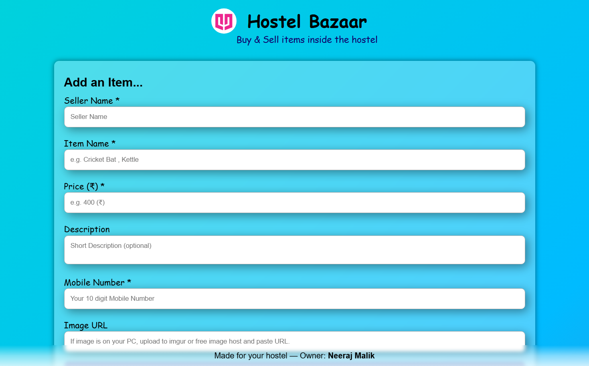

# Hostel Bazaar 🛒

A modern hostel marketplace web application where students can buy and sell used items within the hostel community.

Built using **HTML, CSS, JavaScript, and Firebase Firestore**.

---

## Live Demo

*(Add your deployment link here after hosting)*

---

## Screenshot



---

## Features

- Add items for sale
- View all listed items
- Contact seller directly via mobile call
- Mark items as sold
- Delete your own listings
- Unique device-based ownership system
- Firebase Firestore database integration
- Responsive clean UI design

---

## Tech Stack

- HTML5
- CSS3
- JavaScript (ES6)
- Firebase Firestore

---

## Project Structure

```bash
Hostel-Bazaar/
│
├── index.html
├── style.css
├── script.js
├── README.md
│
└── assets/
    ├── Quantum Logo.png
    └── screenshot.png
```

---

## Firebase Setup

1. Create Firebase project.
2. Enable Firestore Database.
3. Replace Firebase config inside `script.js`.
4. Set Firestore security rules.

---

## Security Note

Firestore rules should be configured properly before production deployment to prevent unauthorized modifications.

---

## Future Improvements

- Firebase Authentication
- Search and Filter functionality
- Category-based listings
- Image Upload with Firebase Storage
- Real-time updates using Firestore listeners

---

## Author

**Neeraj Malik**

Made with dedication for hostel students.

---

## Show Your Support

Give a star if you like this project!